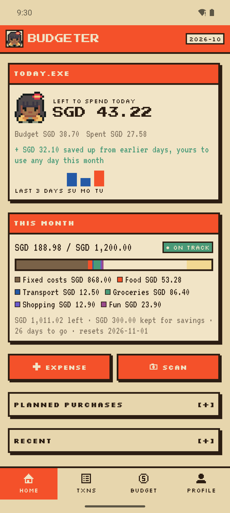
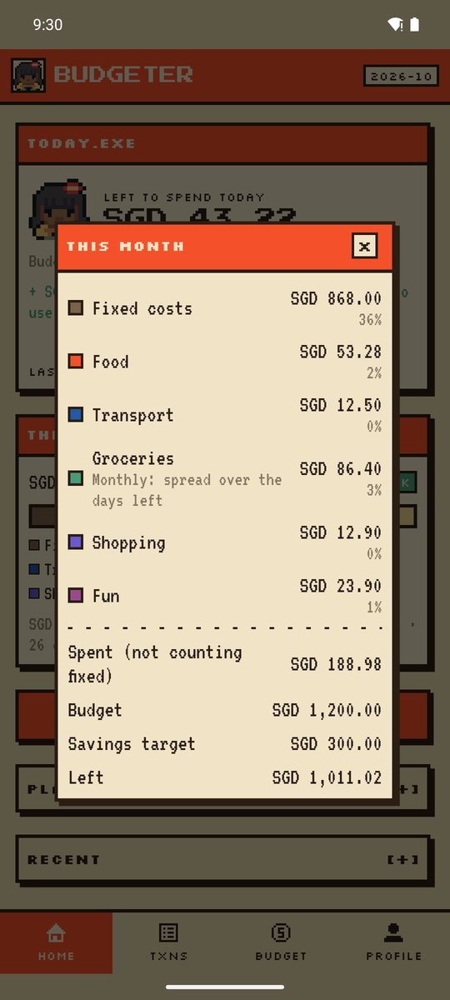
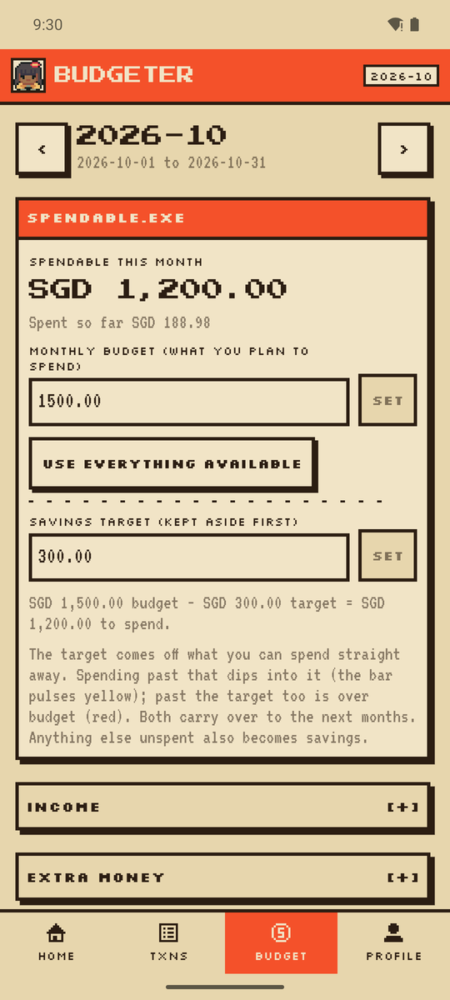
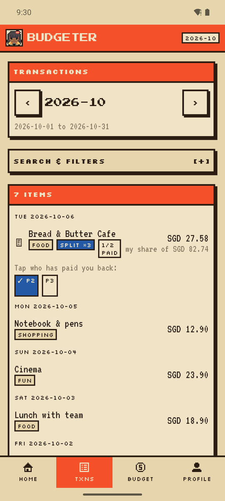
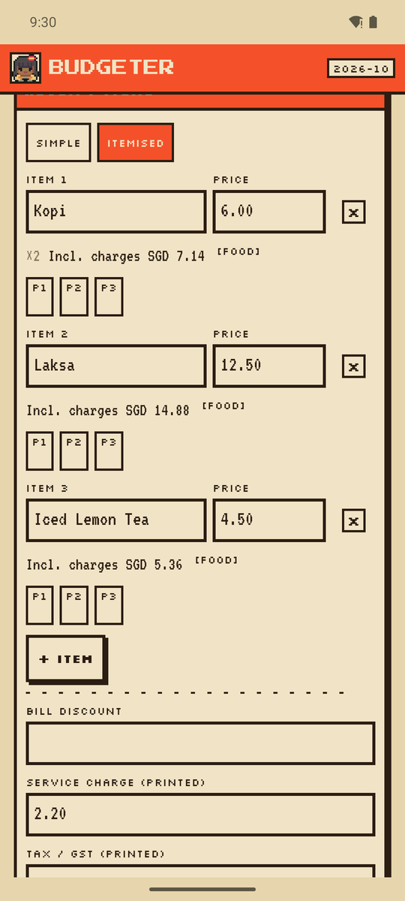
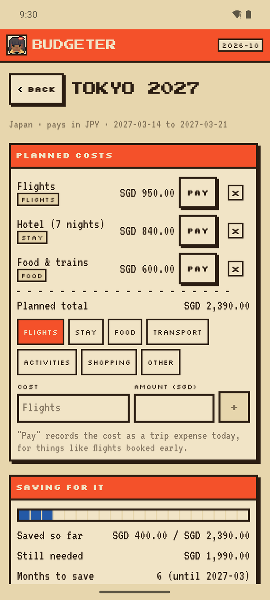
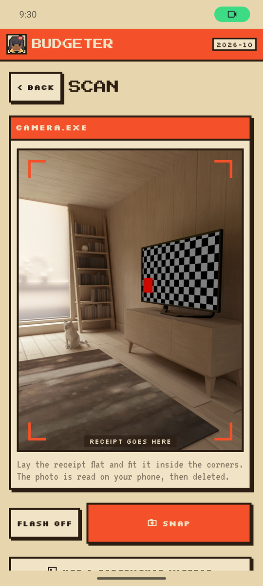
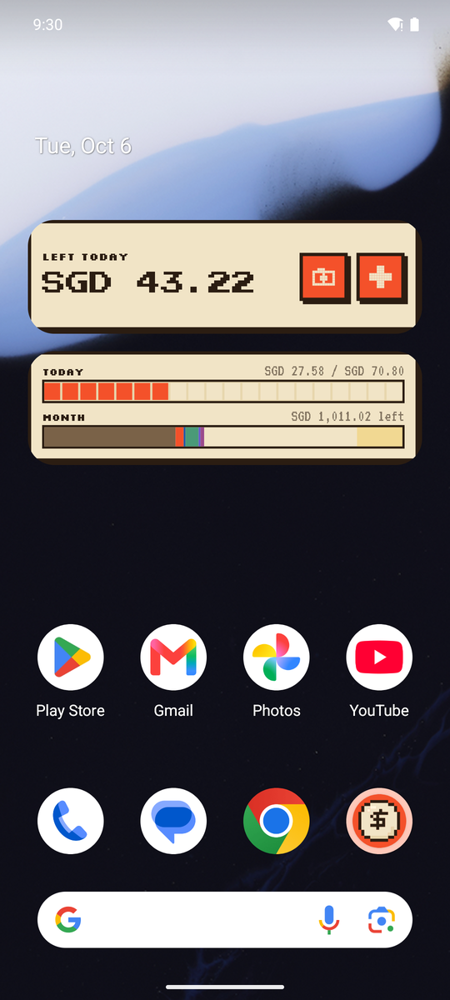

# Budgeter

Pixel-art Android budget planner for one person. Set a monthly budget and a savings target, see what you can spend today (unspent days carry forward), scan receipts on the phone and split them per item including service charge and GST, plan trips and save for them month by month, and keep a copy in your own Google Sheet. Two home-screen widgets.

Plan and decisions: [PLAN.md](PLAN.md). Art list: [docs/GRAPHICS.md](docs/GRAPHICS.md). Sheets setup: [docs/google-setup.md](docs/google-setup.md).

## Screenshots

| Home | Month in numbers | Budget | Transactions |
|---|---|---|---|
|  |  |  |  |

| Receipt split by item | Trip budget | Receipt camera | Widgets |
|---|---|---|---|
|  |  |  |  |

## Get the app

Download the latest `budgeter-vX.Y.Z.apk` from [Releases](https://github.com/nyx-ulrix/budgeter/releases/latest) and open it on the phone. After that the app updates itself: when a new release is out it shows a blue **Update** strip, or use Profile → Updates → Check for updates.

## Install from this PC (any plugged-in Android device)

Double-click **`Install on phone.cmd`**. It builds the app, waits for a device, and installs and opens it on every phone plugged in by USB.

The phone needs USB debugging once: Settings → About phone → tap **Build number** 7 times, then Developer options → **USB debugging**. On Oppo/ColorOS: Settings → About device → Version → tap Build number. Accept the "Allow USB debugging" prompt when you plug in.

## Publish an update

1. Commit your changes.
2. Double-click **`Publish release.cmd`** and type the new version, for example `0.3.0`.

It runs the tests, tags the commit and pushes. GitHub Actions ([release.yml](.github/workflows/release.yml)) builds the signed APK and publishes the release, and installed apps offer the update.

Every build, from this PC or from GitHub, is signed with the same release key (`keystore.properties`, not in git; the key file lives in `C:\Users\malco\.android\`). Android only installs an update signed with that key, so **keep a backup of the key file and `keystore.properties`**. Losing them means users must uninstall to get new versions.

## Tests

```bash
./gradlew testDebugUnitTest
```

Windows needs Android Studio's Java first, for example in Git Bash: `export JAVA_HOME="C:/Program Files/Android/Android Studio/jbr"`.

## Cheapest AI setup

Get a free Gemini key at https://aistudio.google.com/apikey and add it under Profile → AI receipt reading. Without any key the built-in offline reader is used.
